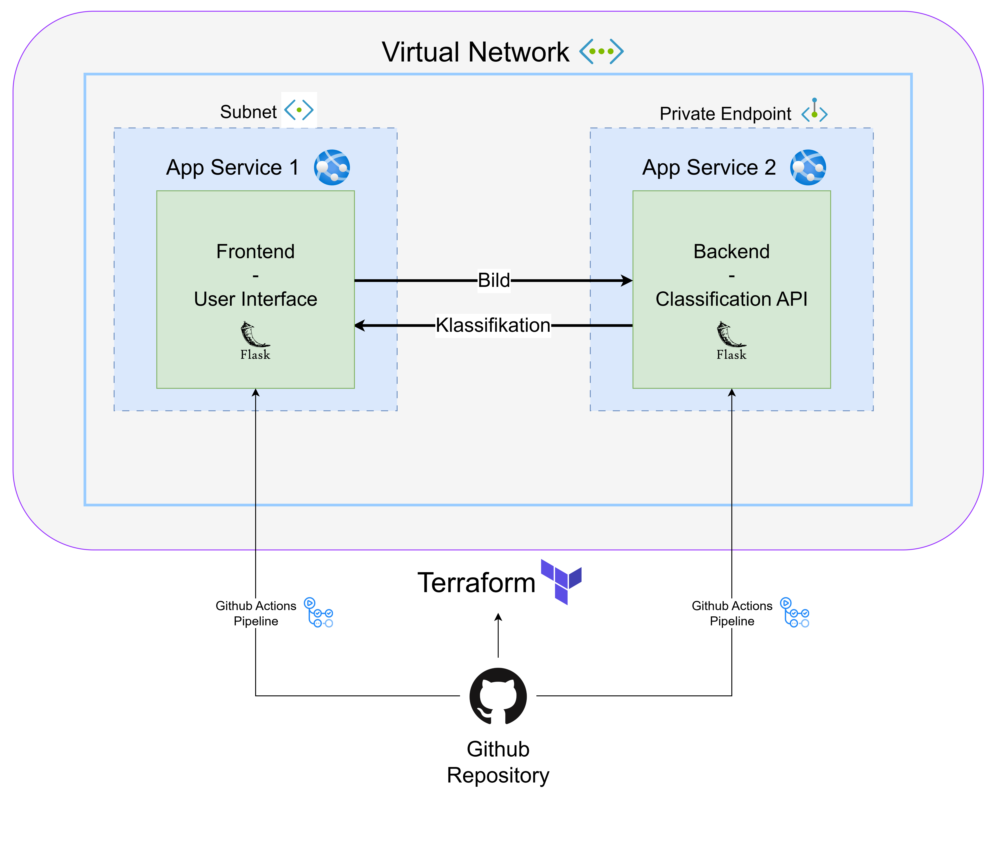

# 🧠 Azure Image Classification

A complete image classification app with frontend and backend components, ready for cloud deployment with CI/CD and infrastructure as code.

## 🚀 Project Overview

This application allows users to upload images via a simple frontend. The images are then sent to a backend API that classifies the content using the [EfficientNet](https://keras.io/api/applications/efficientnet/) model.

## 📦 Architecture

- **Frontend**  
  A user interface for uploading images and displaying classification results.

- **Backend**  
  A REST API that processes images and performs classification using EfficientNet.

## ⚙️ Automated Deployment

The project uses two separate **CI/CD pipelines** for automated deployment:

- One for the **frontend**
- One for the **backend**

➡️ See the `.github/workflows/` directory for the GitHub Actions configurations.

## ☁️ Infrastructure with Terraform

The entire infrastructure can be deployed to **Microsoft Azure** using [Terraform](https://www.terraform.io/).

### 🔧 Deployment Steps

1. Navigate to the `terraform/` directory.
2. Initialize Terraform:

   ```bash
   terraform init
   ```

3. Create a `terraform.tfvars` file with your Azure subscription ID:

   ```hcl
   subscription_id = "your-subscription-id"
   ```

4. Apply the configuration to deploy:

   ```bash
   terraform apply
   ```

## 📁 Project Structure

```bash
.
├── backend/                # Backend API using EfficientNet
├── frontend/               # Web UI for uploading images
├── terraform/              # Azure infrastructure definitions
├── .github/workflows/      # CI/CD pipelines for frontend and backend
└── README.md               # Project documentation
```

## 🧪 Technologies Used

- **Backend:** Flask, TensorFlow/Keras (EfficientNet)
- **Frontend:** Flask
- **Infrastructure:** Azure, Terraform
- **CI/CD:** GitHub Actions

---

## 🗂️ Architecture Diagram

The architecture can be seen here:

